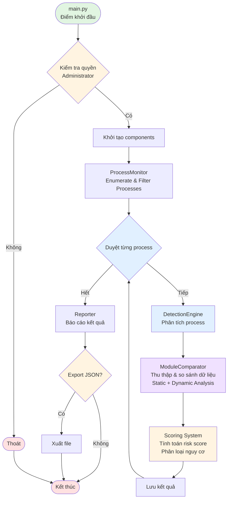

# Cơ chế phát hiện Process Hollowing

## Cơ chế hoạt động tổng thể

### Phân loại phương pháp phát hiện

Hệ thống sử dụng **phương pháp lai (Hybrid Analysis)** kết hợp cả static và dynamic analysis:

#### 1. Static Analysis (Phân tích tĩnh)
Phân tích PE file trên disk mà không thực thi, sử dụng thư viện `pefile`:
- Đọc Import Table để lấy danh sách DLL được khai báo (expected modules)
- Trích xuất Entry Point RVA (Relative Virtual Address) từ Optional Header
- Lấy Image Base address mặc định
- Thu thập thông tin sections (tên, virtual address, size, characteristics)
- Tính hash MD5 cho từng section (để so sánh integrity)

#### 2. Dynamic Analysis (Phân tích động)
Phân tích process đang chạy trong memory thông qua Windows API:
- **EnumProcessModules**: Liệt kê modules thực tế được load vào process space
- **GetModuleFileNameExW**: Lấy đường dẫn đầy đủ của mỗi module
- **GetModuleInformation**: Thu thập base address, size và entry point thực tế
- **VirtualQueryEx**: Quét toàn bộ memory regions để phát hiện vùng executable không map từ file
- **ReadProcessMemory**: Đọc nội dung memory (nếu cần verify section integrity)

#### 3. Hybrid Analysis (Phân tích lai)
So sánh dữ liệu từ static và dynamic analysis để phát hiện bất thường:
- **Module comparison**: So sánh expected_dlls vs loaded_dlls
- **Entry point verification**: So sánh entry point từ PE header vs entry point trong memory
- **Memory anomaly detection**: Phát hiện executable regions không được map từ file (có thể là injected code)
- **Section integrity check**: So sánh metadata sections giữa file và memory

### Kiến trúc hệ thống

Hệ thống được thiết kế theo kiến trúc module hóa với 4 tầng chính:

1. **Tầng điều khiển** ([main.py](main.py)): Xử lý đầu vào, điều phối luồng thực thi và xuất kết quả
2. **Tầng giám sát process** ([process_monitor.py](core/process_monitor.py)): Tương tác với Windows API để thu thập thông tin process và memory
3. **Tầng phân tích** ([pe_analyzer.py](core/pe_analyzer.py), [module_comparator.py](core/module_comparator.py)): Phân tích PE file và so sánh với runtime state
4. **Tầng phát hiện** ([detector.py](core/detector.py)): Đánh giá bất thường và phân loại nguy cơ

### Sơ đồ hoạt động tổng quan



### Giải thích các giai đoạn chính

**Giai đoạn 1: Khởi tạo và quét processes**
- Kiểm tra quyền Administrator (bắt buộc để đọc process memory qua Windows API)
- Khởi tạo ProcessMonitor và DetectionEngine
- Enumerate processes bằng `psutil.process_iter()` và lọc theo điều kiện (PID, tên hoặc scan toàn bộ)

**Giai đoạn 2: Thu thập dữ liệu (Hybrid Analysis)**
- **Static Analysis** (PEAnalyzer): Parse PE file từ disk để lấy Import Table, Entry Point, Image Base và thông tin sections
- **Dynamic Analysis** (ProcessMonitor): Đọc process memory qua Windows API (`EnumProcessModules`, `VirtualQueryEx`) để lấy modules và memory regions thực tế
- Hai nguồn dữ liệu được thu thập song song và độc lập

**Giai đoạn 3: So sánh và phát hiện bất thường (ModuleComparator)**

Thực hiện 4 phép so sánh chính:

1. **Module Comparison**: So sánh expected_dlls từ Import Table với loaded_dlls trong memory
   - Tính missing_ratio và số lượng critical missing DLLs
   - Ngưỡng: missing_ratio > 70% hoặc loaded_count < 2

2. **Entry Point Check**: So sánh entry point giữa file và memory
   - Tính offset_difference = |memory_entry - (memory_base + file_entry_point)|
   - Ngưỡng: offset > 1MB (CRITICAL) hoặc > 320KB (HIGH)

3. **Unmapped Executable Memory**: Phát hiện vùng executable không map từ file
   - Lọc regions có quyền executable nhưng Type ≠ MEM_IMAGE
   - Ngưỡng: count > 50 (HIGH) hoặc > 30 (MEDIUM)

4. **Section Integrity**: So sánh metadata sections (số lượng, tên, virtual address)

**Giai đoạn 4: Chấm điểm và phân loại (DetectionEngine)**
- Mỗi bất thường được gán severity level (CRITICAL: 30, HIGH: 20, MEDIUM: 10, LOW: 5)
- Tính tổng risk_score (0-100)
- Kiểm tra process có trong whitelist không (trusted processes)
- Áp dụng ngưỡng khác nhau:
  - **Untrusted**: suspicious nếu score ≥ 40 hoặc critical_indicators ≥ 2
  - **Trusted**: suspicious nếu score ≥ 60 hoặc critical_indicators ≥ 3

**Giai đoạn 5: Báo cáo kết quả (Reporter)**
- Hiển thị summary: thống kê tổng số processes, clean, suspicious, likely hollowed
- In detailed report cho từng process suspicious với danh sách indicators
- Export kết quả ra file JSON nếu có tham số --output

### Hệ thống chấm điểm

Mỗi bất thường được gán **severity level** và **weight score**:

| Severity | Weight | Ý nghĩa |
|----------|--------|---------|
| CRITICAL | 30 | Dấu hiệu rõ ràng của hollowing |
| HIGH | 20 | Bất thường nghiêm trọng |
| MEDIUM | 10 | Bất thường trung bình |
| LOW | 5 | Bất thường nhẹ |
| INFO | 0 | Thông tin tham khảo |

**Risk Score** = Tổng weight của các indicators phát hiện được (max 100)

**Risk Level** được phân loại theo ngưỡng:
- Score ≥ 50: **CRITICAL** - Very likely hollowed
- Score ≥ 30: **HIGH** - Suspicious activity detected
- Score ≥ 15: **MEDIUM** - Some anomalies detected
- Score > 0: **LOW** - Minor anomalies
- Score = 0: **CLEAN** - No suspicious activity

### Cơ chế lọc False Positive

Hệ thống áp dụng whitelist cho các **trusted processes** có behavior đặc biệt hợp lệ:
- Ứng dụng Electron: `zalo.exe`, `code.exe`, `teams.exe`, `discord.exe`
- Browsers: `chrome.exe`, `firefox.exe`, `msedge.exe`
- Development tools: `devenv.exe`, `rider64.exe`, `webstorm64.exe`
- Runtimes: `python.exe`, `node.exe`, `java.exe`

Với trusted processes, ngưỡng phát hiện được nâng cao để giảm cảnh báo nhầm.

---

## Tổng quan

Tool sử dụng **4 cơ chế phát hiện chính** dựa trên việc so sánh giữa **PE file trên disk** và **process trong memory**.

---

## 1️⃣ Phát hiện Module/DLL bị thiếu (Missing Modules Detection)

### Nguyên lý
- Process bình thường phải load đầy đủ các DLL được khai báo trong **Import Table** của PE file
- Process bị hollowing thường chỉ load rất ít DLL vì code gốc đã bị thay thế bằng malware

### Quy trình phát hiện

#### Bước 1: Đọc Import Table từ PE file
```python
# File: core/pe_analyzer.py
def get_imported_dlls(self) -> List[str]:
    """Lấy danh sách DLL từ Import Table của PE file"""
    if not self.is_valid or not self.pe:
        return []
    
    imported_dlls = []
    try:
        if hasattr(self.pe, 'DIRECTORY_ENTRY_IMPORT'):
            for entry in self.pe.DIRECTORY_ENTRY_IMPORT:
                dll_name = entry.dll.decode('utf-8').lower()
                imported_dlls.append(dll_name)
    except Exception as e:
        pass
    
    return imported_dlls
```

#### Bước 2: Enumerate modules trong memory
```python
# File: core/process_monitor.py
def get_process_modules(self, pid: int) -> List[Dict]:
    """Lấy danh sách modules (DLLs) được load trong process"""
    modules = []
    
    # Mở process với quyền đọc
    h_process = self.kernel32.OpenProcess(
        PROCESS_QUERY_INFORMATION | PROCESS_VM_READ,
        False,
        pid
    )
    
    if not h_process:
        return modules
    
    # Enumerate modules bằng Windows API
    module_handles = (wintypes.HMODULE * 1024)()
    cb_needed = wintypes.DWORD()
    
    if self.psapi.EnumProcessModules(
        h_process,
        ctypes.byref(module_handles),
        ctypes.sizeof(module_handles),
        ctypes.byref(cb_needed)
    ):
        module_count = cb_needed.value // ctypes.sizeof(wintypes.HMODULE)
        
        for i in range(module_count):
            # Lấy tên module
            module_name = ctypes.create_unicode_buffer(260)
            self.psapi.GetModuleFileNameExW(
                h_process,
                module_handles[i],
                module_name,
                260
            )
            
            # Lấy thông tin module (base address, size, entry point)
            module_info = ctypes.create_string_buffer(24)
            self.psapi.GetModuleInformation(
                h_process,
                module_handles[i],
                module_info,
                24
            )
            
            base_address = ctypes.c_void_p.from_buffer(module_info, 0).value
            size_of_image = ctypes.c_ulong.from_buffer(module_info, 8).value
            entry_point = ctypes.c_void_p.from_buffer(module_info, 16).value
            
            modules.append({
                'name': os.path.basename(module_name.value).lower(),
                'path': module_name.value,
                'base_address': base_address,
                'size': size_of_image,
                'entry_point': entry_point
            })
    
    self.kernel32.CloseHandle(h_process)
    return modules
```

#### Bước 3: So sánh DLL expected vs loaded
```python
# File: core/module_comparator.py
def compare_modules(self, exe_path: str, pid: int) -> Dict:
    """So sánh modules từ PE file với modules trong memory"""
    
    # Lấy DLLs từ Import Table (expected)
    pe_analyzer = PEAnalyzer(exe_path)
    expected_dlls = set(pe_analyzer.get_imported_dlls())
    
    # Lấy modules được load trong memory (actual)
    loaded_modules = self.process_monitor.get_process_modules(pid)
    loaded_dll_names = set([mod['name'] for mod in loaded_modules])
    
    # So sánh: DLL nào bị thiếu?
    missing_dlls = expected_dlls - loaded_dll_names
    
    # Lọc bỏ system DLLs (luôn được load ngầm)
    system_dlls = {
        'ntdll.dll', 'kernel32.dll', 'kernelbase.dll',
        'user32.dll', 'gdi32.dll', 'msvcrt.dll'
    }
    critical_missing_dlls = missing_dlls - system_dlls
    
    pe_analyzer.close()
    
    return {
        'success': True,
        'expected_dlls': list(expected_dlls),
        'loaded_dlls': list(loaded_dll_names),
        'missing_dlls': list(missing_dlls),
        'critical_missing_dlls': list(critical_missing_dlls),
        'critical_missing_count': len(critical_missing_dlls)
    }
```

#### Bước 4: Đánh giá và scoring
```python
# File: core/detector.py
def _check_missing_modules(self, analysis: Dict, indicator: HollowingIndicator, is_trusted: bool = False):
    """Kiểm tra modules bị thiếu"""
    module_comp = analysis.get('module_comparison', {})
    
    if not module_comp.get('success'):
        return
    
    critical_missing = module_comp.get('critical_missing_count', 0)
    loaded_count = len(module_comp.get('loaded_dlls', []))
    expected_count = len(module_comp.get('expected_dlls', []))
    
    # Tính tỷ lệ DLL bị thiếu
    missing_ratio = critical_missing / max(expected_count, 1) if expected_count > 0 else 0
    
    # Cảnh báo nếu tỷ lệ thiếu quá cao (> 70%)
    if missing_ratio > 0.7 and critical_missing > 10:
        indicator.add_indicator(
            "Critical DLLs Missing",
            True,
            HollowingIndicator.SEVERITY_CRITICAL,  # +30 điểm
            f"{critical_missing}/{expected_count} DLLs missing ({missing_ratio*100:.0f}%)"
        )
    elif missing_ratio > 0.5 and critical_missing > 8:
        indicator.add_indicator(
            "Many DLLs Missing",
            True,
            HollowingIndicator.SEVERITY_HIGH,  # +20 điểm
            f"{critical_missing}/{expected_count} DLLs missing ({missing_ratio*100:.0f}%)"
        )
    
    # Cảnh báo nếu quá ít modules được load (< 2)
    if loaded_count < 2 and not is_trusted:
        indicator.add_indicator(
            "Very Few Modules Loaded",
            True,
            HollowingIndicator.SEVERITY_CRITICAL,  # +30 điểm
            f"Only {loaded_count} modules loaded - highly suspicious"
        )
```

### Ví dụ
**Process bình thường:**
```
chrome.exe
- Expected DLLs: 45
- Loaded DLLs: 47
- Missing: 0
→ Score: 0 (CLEAN)
```

**Process bị hollowing:**
```
svchost.exe
- Expected DLLs: 45
- Loaded DLLs: 2 (chỉ có ntdll.dll, kernel32.dll)
- Missing: 43 (95%)
→ Score: +30 (CRITICAL)
```

---

## 2️⃣ Phát hiện Entry Point Mismatch

### Nguyên lý
- Mỗi PE file có **entry point** - địa chỉ đầu tiên mà CPU sẽ thực thi
- Process bình thường: `Entry Point trong memory = Base Address + Entry Point từ file`
- Process bị hollowing: Entry point bị malware thay đổi để trỏ vào code độc

### Quy trình phát hiện

#### Bước 1: Lấy entry point từ PE file
```python
# File: core/pe_analyzer.py
def get_entry_point(self) -> int:
    """Lấy Entry Point từ PE Optional Header"""
    if not self.is_valid or not self.pe:
        return 0
    
    try:
        return self.pe.OPTIONAL_HEADER.AddressOfEntryPoint
    except:
        return 0

def get_image_base(self) -> int:
    """Lấy Image Base address mặc định"""
    try:
        return self.pe.OPTIONAL_HEADER.ImageBase
    except:
        return 0
```

#### Bước 2: So sánh entry point
```python
# File: core/module_comparator.py
def check_entry_point(self, exe_path: str, pid: int) -> Dict:
    """So sánh entry point từ file với entry point trong memory"""
    
    # 1. Lấy entry point từ PE file
    pe_analyzer = PEAnalyzer(exe_path)
    file_entry_point = pe_analyzer.get_entry_point()  # VD: 0x1000 (RVA)
    file_image_base = pe_analyzer.get_image_base()    # VD: 0x400000
    
    # 2. Lấy entry point từ memory
    modules = self.process_monitor.get_process_modules(pid)
    if not modules:
        return {'success': False, 'error': 'Cannot get process modules'}
    
    main_module = modules[0]  # Module đầu tiên = main executable
    memory_base = main_module['base_address']     # VD: 0x7FF600000000 (ASLR)
    memory_entry = main_module['entry_point']     # Entry point thực tế
    
    # 3. Tính entry point mong đợi
    expected_entry = memory_base + file_entry_point
    # Expected: 0x7FF600000000 + 0x1000 = 0x7FF600001000
    
    # 4. So sánh
    entry_point_mismatch = (memory_entry != expected_entry)
    offset_diff = abs(memory_entry - expected_entry) if memory_entry and expected_entry else 0
    
    pe_analyzer.close()
    
    return {
        'success': True,
        'file_entry_point': file_entry_point,
        'memory_base': memory_base,
        'memory_entry': memory_entry,
        'expected_entry': expected_entry,
        'mismatch': entry_point_mismatch,
        'offset_difference': offset_diff
    }
```

#### Bước 3: Đánh giá
```python
# File: core/detector.py
def _check_entry_point_mismatch(self, analysis: Dict, indicator: HollowingIndicator, is_trusted: bool = False):
    """Kiểm tra entry point có khớp không"""
    entry_check = analysis.get('entry_point_check', {})
    
    if not entry_check.get('success'):
        return
    
    if entry_check.get('mismatch'):
        offset_diff = entry_check.get('offset_difference', 0)
        
        # Chỉ cảnh báo nếu sai lệch CỰC KỲ lớn (> 1MB)
        # Bỏ qua sai lệch nhỏ do ASLR, JIT compiler, dynamic loading
        if offset_diff > 0x100000:  # > 1MB
            indicator.add_indicator(
                "Entry Point Mismatch",
                True,
                HollowingIndicator.SEVERITY_CRITICAL,  # +30 điểm
                f"Entry point differs by 0x{offset_diff:X} from expected"
            )
        elif offset_diff > 0x50000 and not is_trusted:  # > 320KB và không trusted
            indicator.add_indicator(
                "Entry Point Deviation",
                True,
                HollowingIndicator.SEVERITY_HIGH,  # +20 điểm
                f"Entry point differs by 0x{offset_diff:X} from expected"
            )
```

### Ví dụ
**Process bình thường:**
```
notepad.exe
- File entry point: 0x1000
- Memory base: 0x7FF600000000 (ASLR)
- Expected: 0x7FF600001000
- Actual: 0x7FF600001000
- Difference: 0
→ Score: 0 (CLEAN)
```

**Process bị hollowing:**
```
notepad.exe
- File entry point: 0x1000
- Memory base: 0x7FF600000000
- Expected: 0x7FF600001000
- Actual: 0x7FF600150000 (malware code!)
- Difference: 0x14F000 (1.3MB)
→ Score: +30 (CRITICAL)
```

---

## 3️⃣ Phát hiện Unmapped Executable Memory

### Nguyên lý
- Process bình thường: Memory executable được **map từ PE file hoặc DLL** (MEM_IMAGE)
- Process bị hollowing: Có vùng memory executable **KHÔNG map từ file nào** (malware inject vào)

### Quy trình phát hiện

#### Bước 1: Quét memory regions
```python
# File: core/process_monitor.py
def get_memory_regions(self, pid: int) -> List[Dict]:
    """Quét tất cả memory regions của process"""
    regions = []
    h_process = self.kernel32.OpenProcess(
        PROCESS_QUERY_INFORMATION | PROCESS_VM_READ,
        False,
        pid
    )
    
    if not h_process:
        return regions
    
    address = 0
    mbi = MEMORY_BASIC_INFORMATION()
    
    # Duyệt qua từng memory region
    while self.kernel32.VirtualQueryEx(
        h_process,
        ctypes.c_void_p(address),
        ctypes.byref(mbi),
        ctypes.sizeof(mbi)
    ):
        # Kiểm tra region có executable không?
        is_executable = (
            mbi.Protect & PAGE_EXECUTE or
            mbi.Protect & PAGE_EXECUTE_READ or
            mbi.Protect & PAGE_EXECUTE_READWRITE or
            mbi.Protect & PAGE_EXECUTE_WRITECOPY
        )
        
        # Kiểm tra có phải mapped image không?
        is_mapped = (mbi.Type == MEM_IMAGE)  # MEM_IMAGE = được map từ file
        
        if mbi.State == MEM_COMMIT and is_executable:
            regions.append({
                'base_address': mbi.BaseAddress,
                'size': mbi.RegionSize,
                'protection': mbi.Protect,
                'is_executable': is_executable,
                'is_mapped': is_mapped,  # False = NGUY HIỂM!
                'type': mbi.Type
            })
        
        address += mbi.RegionSize
    
    self.kernel32.CloseHandle(h_process)
    return regions
```

#### Bước 2: Lọc unmapped executable memory
```python
# File: core/module_comparator.py
def check_unmapped_executable_memory(self, pid: int) -> Dict:
    """Kiểm tra memory executable không mapped từ file"""
    memory_regions = self.process_monitor.get_memory_regions(pid)
    
    # Lọc: executable NHƯNG không phải mapped image
    unmapped_executable = [
        region for region in memory_regions
        if region['is_executable'] and not region['is_mapped']
    ]
    
    return {
        'success': True,
        'total_executable_regions': len([r for r in memory_regions if r['is_executable']]),
        'unmapped_executable_regions': len(unmapped_executable),
        'unmapped_regions': unmapped_executable,
        'has_suspicious_memory': len(unmapped_executable) > 0
    }
```

#### Bước 3: Đánh giá
```python
# File: core/detector.py
def _check_unmapped_memory(self, analysis: Dict, indicator: HollowingIndicator, is_trusted: bool = False):
    """Kiểm tra unmapped executable memory"""
    unmapped_check = analysis.get('unmapped_memory_check', {})
    
    if not unmapped_check.get('success'):
        return
    
    unmapped_count = unmapped_check.get('unmapped_executable_regions', 0)
    
    # JIT compilers (Chrome, .NET, Java) thường có nhiều unmapped memory hợp lệ
    # Chỉ cảnh báo nếu có RẤT NHIỀU (> 50)
    if unmapped_count > 50:
        indicator.add_indicator(
            "Excessive Unmapped Executable Memory",
            True,
            HollowingIndicator.SEVERITY_HIGH,  # +20 điểm
            f"{unmapped_count} executable regions not mapped from files"
        )
    elif unmapped_count > 30 and not is_trusted:
        indicator.add_indicator(
            "Many Unmapped Executable Regions",
            True,
            HollowingIndicator.SEVERITY_MEDIUM,  # +10 điểm
            f"{unmapped_count} executable regions not mapped from files"
        )
```

### Ví dụ
**Process bình thường (Chrome với V8 JIT):**
```
chrome.exe
- Total executable regions: 25
- Unmapped executable: 12 (JIT compiled code)
- Threshold: < 50
→ Score: 0 (CLEAN - JIT compiler hợp lệ)
```

**Process bị hollowing:**
```
svchost.exe
- Total executable regions: 80
- Unmapped executable: 65 (malware inject!)
- Threshold: > 50
→ Score: +20 (HIGH)
```

---

## 4️⃣ Hệ thống Scoring và Combined Logic

### Severity Levels và Trọng số
```python
# File: core/detector.py
class HollowingIndicator:
    SEVERITY_CRITICAL = "CRITICAL"  # 30 điểm
    SEVERITY_HIGH = "HIGH"          # 20 điểm
    SEVERITY_MEDIUM = "MEDIUM"      # 10 điểm
    SEVERITY_LOW = "LOW"            # 5 điểm
    
    def __init__(self):
        self.indicators = []
        self.score = 0
    
    def add_indicator(self, name: str, detected: bool, severity: str, details: str):
        weights = {
            self.SEVERITY_CRITICAL: 30,
            self.SEVERITY_HIGH: 20,
            self.SEVERITY_MEDIUM: 10,
            self.SEVERITY_LOW: 5,
        }
        
        if detected:
            self.score += weights.get(severity, 0)
            self.indicators.append({
                'name': name,
                'severity': severity,
                'details': details,
                'weight': weights.get(severity, 0)
            })
    
    def get_risk_level(self) -> str:
        if self.score >= 50:
            return "CRITICAL - Very likely hollowed"
        elif self.score >= 30:
            return "HIGH - Suspicious activity detected"
        elif self.score >= 15:
            return "MEDIUM - Some anomalies detected"
        else:
            return "LOW - Minor anomalies"
```

### Whitelist và Trusted Processes
```python
# File: core/detector.py
class DetectionEngine:
    def __init__(self):
        self.comparator = ModuleComparator()
        
        # Whitelist - các process thường có behavior đặc biệt
        self.trusted_processes = {
            'zalo.exe', 'electron.exe', 'chrome.exe', 'firefox.exe',
            'msedge.exe', 'teams.exe', 'slack.exe', 'discord.exe',
            'code.exe', 'devenv.exe', 'rider64.exe', 'webstorm64.exe',
            'git.exe', 'bash.exe', 'sh.exe', 'wsl.exe',
            'python.exe', 'node.exe', 'java.exe', 'javaw.exe',
            'windowscopilot.exe', 'copilot.exe'
        }
```

### Combined Logic
```python
# File: core/detector.py
def analyze_process(self, exe_path: str, pid: int) -> Dict:
    """Phân tích process với combined logic"""
    
    # Thu thập dữ liệu
    analysis = self.comparator.get_comprehensive_analysis(exe_path, pid)
    indicator = HollowingIndicator()
    
    # Kiểm tra whitelist
    process_name = exe_path.split('\\')[-1].lower()
    is_trusted = process_name in self.trusted_processes
    
    # Chạy các kiểm tra
    self._check_missing_modules(analysis, indicator, is_trusted)
    self._check_entry_point_mismatch(analysis, indicator, is_trusted)
    self._check_unmapped_memory(analysis, indicator, is_trusted)
    
    # Đếm số indicators nghiêm trọng
    critical_indicators = len([i for i in indicator.indicators 
                               if i['severity'] == 'CRITICAL'])
    high_indicators = len([i for i in indicator.indicators 
                          if i['severity'] == 'HIGH'])
    
    # Combined logic: yêu cầu nhiều indicators nghiêm trọng cùng lúc
    is_suspicious = False
    is_likely_hollowed = False
    
    if not is_trusted:
        # Process không trusted: ngưỡng thấp hơn
        is_suspicious = (indicator.score >= 40) or (critical_indicators >= 2)
        is_likely_hollowed = (indicator.score >= 60) or (critical_indicators >= 3)
    else:
        # Process trusted: ngưỡng cao để tránh false positive
        is_suspicious = (indicator.score >= 60) or (critical_indicators >= 3)
        is_likely_hollowed = (indicator.score >= 80)
    
    return {
        'pid': pid,
        'process_name': process_name,
        'is_trusted': is_trusted,
        'risk_score': indicator.score,
        'risk_level': indicator.get_risk_level(),
        'is_suspicious': is_suspicious,
        'is_likely_hollowed': is_likely_hollowed,
        'indicators': indicator.indicators,
        'critical_indicators': critical_indicators,
        'high_indicators': high_indicators
    }
```

---

## 📊 So sánh Process Bình thường vs Bị Hollowing

### Process bình thường (chrome.exe - Trusted)
```
╔══════════════════════════════════════════════════════════╗
║ chrome.exe (PID: 5432) - TRUSTED                        ║
╠══════════════════════════════════════════════════════════╣
║ Module Analysis:                                         ║
║   - Expected DLLs: 45                                    ║
║   - Loaded DLLs: 47                                      ║
║   - Missing: 0                                           ║
║   → Score: 0                                             ║
║                                                          ║
║ Entry Point:                                             ║
║   - Expected: 0x7FF600001000                             ║
║   - Actual: 0x7FF600001000                               ║
║   - Difference: 0                                        ║
║   → Score: 0                                             ║
║                                                          ║
║ Unmapped Memory:                                         ║
║   - Total executable: 25                                 ║
║   - Unmapped: 12 (JIT compiler)                          ║
║   → Score: 0 (Legitimate JIT)                            ║
║                                                          ║
║ TOTAL SCORE: 0/100                                       ║
║ RISK LEVEL: CLEAN                                        ║
║ CRITICAL Indicators: 0                                   ║
╚══════════════════════════════════════════════════════════╝
```

### Process bị hollowing (svchost.exe)
```
╔══════════════════════════════════════════════════════════╗
║ svchost.exe (PID: 2156) - UNTRUSTED                     ║
╠══════════════════════════════════════════════════════════╣
║ ⚠️ Module Analysis:                                      ║
║   - Expected DLLs: 45                                    ║
║   - Loaded DLLs: 2 (ntdll, kernel32)                     ║
║   - Missing: 43/45 (95%)                                 ║
║   → Score: +30 (CRITICAL)                                ║
║                                                          ║
║ ⚠️ Entry Point:                                          ║
║   - Expected: 0x7FF600001000                             ║
║   - Actual: 0x7FF600150000                               ║
║   - Difference: 0x14F000 (1.3MB)                         ║
║   → Score: +30 (CRITICAL)                                ║
║                                                          ║
║ ⚠️ Unmapped Memory:                                      ║
║   - Total executable: 80                                 ║
║   - Unmapped: 65 (NOT mapped from files!)                ║
║   → Score: +20 (HIGH)                                    ║
║                                                          ║
║ TOTAL SCORE: 80/100                                      ║
║ RISK LEVEL: CRITICAL - Very likely hollowed              ║
║ CRITICAL Indicators: 2                                   ║
║ HIGH Indicators: 1                                       ║
╚══════════════════════════════════════════════════════════╝
```

---

## 🎯 Tổng kết

### Điểm mạnh của cơ chế
✅ **Phát hiện dựa trên triệu chứng**, không phụ thuộc vào signature  
✅ **Kết hợp nhiều indicators** để tăng độ chính xác  
✅ **Whitelist cho ứng dụng hợp lệ** để giảm false positive  
✅ **Scoring system linh hoạt** với các mức độ nghiêm trọng  
✅ **Combined logic** yêu cầu nhiều indicators nghiêm trọng cùng lúc  

### Hạn chế
❌ **Không phát hiện được kỹ thuật cụ thể** mà malware sử dụng  
❌ **Cần quyền Administrator** để đọc memory của processes  
❌ **Có thể có false positive** với các ứng dụng có kiến trúc đặc biệt  
❌ **Không phát hiện được** nếu malware rất tinh vi (load đầy đủ DLL, không thay đổi entry point)  

### Độ chính xác
- **True Positive Rate**: Cao (phát hiện được hầu hết process bị hollowing)
- **False Positive Rate**: Thấp (nhờ whitelist và combined logic)
- **True Negative Rate**: Cao (ứng dụng bình thường không bị cảnh báo)
